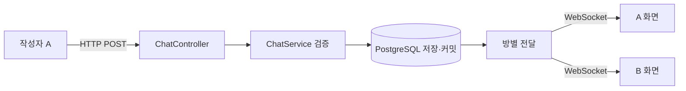
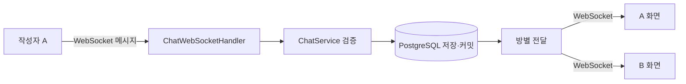

# 2026-10-10 개발 기록

## 작업 상태

WebSocket echo를 직접 작성하는 과정에서 수정한 코드의 재검토를 요청했다. 날짜가 바뀌었으므로 이전 기록에 추가하지 않고 이 파일을 만든다. 이번 요청은 리뷰이며 개발 환경을 다시 시작하거나 코드를 대신 구현하지 않았다.

## echo 코드 재리뷰

**요청:** code-review 스킬로 다시 확인한다.

**리뷰 기준:** 앞서 사용자와 확인한 HEAD(`ce1dff9`) 이후 미커밋 WebSocket 세 파일. `git diff HEAD -- <세 파일>`로 변경을 확인했다. Standards와 Spec을 별도 서브 에이전트로 검토했으며 명세는 `261009.md`의 echo 목표와 `NEXT.md`다.

### 해결된 점과 검증 결과

- 핸들러의 닫는 중괄호 오류가 해결되었다.
- `handleTextMessage`에서 payload를 읽고 `session.sendMessage`로 전송한다.
- 설정 클래스에 `@Configuration`, `@EnableWebSocket`, `WebSocketConfigurer`와 경로 등록을 작성했다.
- 테스트도 실제 연결 시도와 문자열 전송, 수신 콜백까지 작성했다.
- `./gradlew compileTestJava`: main 코드 컴파일은 성공, 테스트 코드 컴파일은 실패. 58행 `Thread.sleep(2000)`의 `InterruptedException`을 잡거나 throws로 선언하지 않았다.
- 런타임 WebSocket 연결과 전체 테스트는 실행하지 못했다. 사용자 코드는 수정하지 않았다.

### Standards — 1건

`AGENTS.md`의 중요한 동작 검증 원칙에 비춰 테스트가 출력만 하는 점이 부족하다. `onText`에서 응답을 출력해도 기대 문자열과 비교하지 않으면 틀린 응답을 실패로 판정하지 못한다. 수신 오류도 출력만 하지 말고 테스트에 전달해야 한다.

### Spec — 3건

1. **핸들러 Bean 등록 누락:** `EchoWebSocketHandler`에는 `@Component`나 별도 `@Bean` 등록이 없다. 설정 클래스는 생성자로 `WebSocketHandler` Bean을 요구하므로 현재 선언만으로는 이를 주입할 수 없다. 인터페이스를 주입하는 것 자체는 문제가 아니며 구현 객체의 등록이 필요하다. 런타임에서 재현한 결과는 아니고 코드 검토로 발견했다.
2. **응답 검증과 제한 시간 대기 누락:** 테스트가 접속 → 전송 → 2초 대기 → 종료를 수행하지만, 실제 응답을 기다리고 assert하지 않는다. `join()`에는 명시적인 시간 제한이 없고, 콜백 오류와 예외 시 연결 정리도 보완해야 한다. 수신 콜백이 `CompletableFuture<String>`에 결과 또는 오류를 전달하고 테스트가 제한 시간 내 결과를 얻어 비교하는 구조를 제안했다.
3. **동일 문자열 반환 목표 불일치:** 핸들러가 `"Echo: "`를 붙여 `Hello Echo` 입력에 `Echo: Hello Echo`를 반환한다. 전송 방식은 동작을 위한 코드지만, 이번 목표인 같은 문자열 반환과 다르다. 접두사를 제외하거나 목표 변경을 합의해야 한다.

다음에는 먼저 예외 처리로 컴파일을 맞추고, 핸들러를 Bean으로 등록하고, 첫 테스트가 실제 수신 문자열을 비교하도록 고친다. JUnit 테스트에서 예외를 메서드의 throws로 넘기면 오류가 테스트 실패로 드러나며, 빈 catch로 숨기지 않는다. `Thread.sleep`으로 시간을 보내는 대신 결과가 도착하면 즉시 진행하고 제한 시간 내 도착하지 않으면 실패하도록 한다.

학습용 echo는 아직 서비스용 채팅이 아니다. 방별 전달·쿠키 인증·운영 시간 정책은 이번 리뷰 범위에 넣지 않았다.

## 응답 검증을 구체화하고 공식 자료 조사

**질문:** 이전 리뷰의 2번(응답 검증)을 제외하고 수정했다. 2번을 더 자세히 설명하고, Java WebSocket을 이해할 수 있는 읽을거리를 알려 달라.

**수정 확인:** 핸들러의 `@Component` 등록과 `Echo: ` 접두사 제거를 확인했다. `./gradlew compileJava`는 성공했다. 테스트 코드는 그대로여서 `Thread.sleep`의 checked exception 처리와 응답 검증은 아직 남아 있다. 이번에 전체 테스트를 다시 실행하지 않았다. Standards와 Spec의 남은 발견은 각각 응답 검증 부재 1건이며, 같은 문제를 서로 다른 기준에서 본 것이다.

**설명:** `buildAsync`의 `CompletableFuture<WebSocket>`는 연결 결과이며 서버 응답 문자열이 아니다. `sendText`의 Future가 완료되어도 echo가 도착했다는 뜻은 아니다. `CompletableFuture<String> received`를 따로 두고 수신 콜백이 결과를 넣으면 테스트 메서드가 제한 시간 내 기다려 비교할 수 있다.

- Listener를 만들기 전에 응답 결과 Future와 조각 누적용 StringBuilder를 준비한다.
- `onText`의 `data`를 누적하고 `last == true`가 되면 전체 문자열로 `received.complete(...)`를 호출한다. 한 메시지가 여러 콜백에 나뉠 수 있으므로 첫 조각을 전체 응답으로 비교하지 않는다.
- `request(1)`은 다음 수신 콜백 호출을 허용하는 수요량을 늘리는 것이다. 서버에 새 HTTP 요청을 보내거나 데이터를 polling하는 뜻이 아니다.
- `onError`에서는 `received.completeExceptionally(error)`로 오류를 대기 중인 테스트에 전달한다.
- 테스트는 연결·전송 Future와 응답 Future에 `get(3, TimeUnit.SECONDS)`로 제한 시간을 두고, `assertEquals("Hello Echo", actual)`로 확인한다. 테스트 메서드는 checked exception을 throws로 전달할 수 있다. 종료 정리는 finally에서 수행한다.
- `Thread.sleep(2000)`은 응답을 확인하지 않고 무조건 2초를 보내므로 제거한다. 쓰이지 않는 첫 `client.newWebSocketBuilder()` 호출도 불필요하다.

학습자가 서버 코드와 테스트 클라이언트 코드를 동시에 처음 접해 이해 없이 옮기고 있다고 설명했다. AI는 구현 속도보다 흐름 이해를 우선하고, 전체 테스트를 대신 작성하지 않고 위치별 작은 코드 예제를 안내했다.

research 스킬에 따라 공식 자료를 조사하는 서브 에이전트를 별도로 사용해 `docs/research/websocket-echo-learning.md`에 읽기 순서와 현재 코드 연결 설명을 정리한다.

참고: [Java 21 WebSocket.Listener](https://docs.oracle.com/en/java/javase/21/docs/api/java.net.http/java/net/http/WebSocket.Listener.html), [CompletableFuture](https://docs.oracle.com/en/java/javase/21/docs/api/java.base/java/util/concurrent/CompletableFuture.html)

## WebSocket은 반드시 Future로 구현해야 할까?

**질문:** WebSocket은 왜 무조건 Future나 CompletableFuture 같은 비동기 계열로 구성되어 있을까?

**답변:** WebSocket 프로토콜은 메시지 교환 규칙이며 Java의 Future 사용을 요구하지 않는다. Java WebSocket 표준에도 동기 전송용 `RemoteEndpoint.Basic`과 비동기 전송용 `RemoteEndpoint.Async`가 있다. 우리가 테스트에 선택한 Java 21 `java.net.http.WebSocket` API가 연결과 전송의 완료를 `CompletableFuture`로 반환하는 것이다.

현재 서버의 Spring `WebSocketSession.sendMessage(...)`는 반환값이 void이고 핸들러도 void 메서드를 재정의한다. 서버 수신이 콜백으로 호출되는 것과 모든 메서드가 Future를 반환한다는 것은 다른 말이다.

WebSocket에서는 한 번 연결한 뒤 양쪽이 메시지를 보낼 수 있으며, 어느 시점에 어떤 메시지가 도착할지 알 수 없다. 클라이언트가 보낸 메시지와 수신 메시지를 프로토콜이 요청·응답 한 쌍으로 자동 연결해주지도 않는다. 그래서 연결 성공·수신·오류 사건을 콜백으로 다루는 API가 자연스럽다. 동기 대기를 선택할 수도 있지만 어떤 결과를 기다릴지, 제한 시간과 종료를 어떻게 처리할지를 정해야 한다.

CompletableFuture는 완료 결과나 실패를 전달하는 객체다. 이를 사용한다는 이유만으로 매번 새 스레드가 만들어지는 것은 아니다. Future의 `get`은 호출한 스레드를 기다리게 할 수도 있다.

우리 코드의 세 완료 사건을 구분했다.

| 코드 | 완료의 뜻 |
| --- | --- |
| `buildAsync`의 Future | 연결 객체가 준비됨 |
| `sendText`의 Future | 메시지 전송 작업이 완료됨 |
| 테스트의 `received` Future | 수신 콜백이 응답 문자열을 전달함 |

마지막 Future는 WebSocket이 요구한 구조가 아니라 테스트가 수신 결과를 기다려 assert하기 위해 선택한 연결 방식이다. 수신 콜백과 결과 대기 코드를 나눠 이해하는 것이 다음 학습 지점이다.

research 스킬로 공식 자료를 조사해 `docs/research/websocket-async-and-future.md`에 상세 근거를 정리한다. 이번에는 구현 변경이나 테스트 실행을 하지 않았다.

참고: [RFC 6455](https://www.rfc-editor.org/rfc/rfc6455), [Jakarta 동기 전송 API](https://jakarta.ee/specifications/websocket/2.2/apidocs/server/jakarta/websocket/remoteendpoint.basic), [Java 21 WebSocket](https://docs.oracle.com/en/java/javase/21/docs/api/java.net.http/java/net/http/WebSocket.html), [Spring WebSocketSession](https://docs.spring.io/spring-framework/docs/current/javadoc-api/org/springframework/web/socket/WebSocketSession.html)

## 설정 → 핸들러 → 테스트 순서로 처음부터 이해하기

**질문:** EchoWebSocketTest가 클라이언트, Configuration이 설정, Handler가 서버 역할이라고 이해했다. 설정, 핸들러, 테스트 만드는 방법을 이 순서로 다시 설명해 달라.

**답변:** 역할 구분은 맞다. 서버 전체는 Spring Boot가 띄운 서버이고, Handler는 그 안에서 수신 메시지를 처리하는 객체다. 테스트 클래스는 서버도 자동으로 띄우며, 메서드 안의 HttpClient/WebSocket이 접속하는 클라이언트 역할을 한다.

### 1. WebSocketConfiguration — 접속 경로와 처리 객체 연결

`com.breakground.config` 패키지에 설정 클래스를 둔다. `@Configuration`은 Spring 설정 클래스, `@EnableWebSocket`은 WebSocket 처리 기반을 활성화하는 표시다. `WebSocketConfigurer`를 구현하고 `registerWebSocketHandlers`에서 `registry.addHandler(webSocketHandler, "/ws/echo")`로 주소와 핸들러를 연결한다. 이 등록은 서버 설정 과정에서 수행되며, 매 메시지마다 설정 클래스를 호출하는 것은 아니다.

현재 `@RequiredArgsConstructor`는 final 핸들러 필드의 생성자를 Lombok이 만들어 준다. Spring이 등록된 EchoWebSocketHandler 객체를 WebSocketHandler 타입으로 주입한다. 인터페이스의 객체를 직접 만드는 것이 아니라 그 인터페이스를 구현하는 객체를 받는 것이다.

현재 `setAllowedOriginPatterns("*")`는 브라우저 출처 검사 허용 범위를 넓히는 설정이다. 주소 등록이나 echo 자체를 위한 필수 줄은 아니다. 일반 REST CORS 설정과 동일한 기능으로 단정하지 않는다.

### 2. EchoWebSocketHandler — 연결에서 받은 문자열 처리

`com.breakground.chat`에 `@Component` 클래스가 `TextWebSocketHandler`를 상속한다. `handleTextMessage(WebSocketSession session, TextMessage message)`를 재정의한다. 수신할 때 Spring이 이 메서드를 호출한다. session은 클라이언트와의 연결 객체이며 AnonymousUser 엔티티가 아니다. message는 수신 메시지다.

현재 구현은 `message.getPayload()`로 문자열을 얻고, `new TextMessage(payload)`로 응답 메시지를 만든 뒤 `session.sendMessage(response)`로 같은 연결에 돌려준다. 다른 연결로 전달하는 채팅 기능은 아직 없다.

### 3. EchoWebSocketTest — 서버 시작과 클라이언트 검증

같은 패키지 이름이지만 `src/test/java`에 둔다. `@SpringBootTest(webEnvironment = RANDOM_PORT)`가 테스트용 실제 서버를 띄우고 `@LocalServerPort`가 실제 포트를 알려 준다. IDE에서 애플리케이션을 따로 실행하지 않아도 이 테스트가 서버를 시작한다. 현재 프로젝트의 전체 설정을 로드하므로 DB 환경도 준비되어야 한다.

메서드 안에서는 HttpClient 생성 → ws 주소 생성 → Listener 준비 → buildAsync로 연결 → sendText로 전송 → onText로 수신 → 제한 시간 내 결과 비교 → 종료 정리 순서로 이해한다. onOpen/onText/onClose/onError는 클라이언트 라이브러리가 사건에 맞춰 호출하는 콜백이다. 서버 Handler와 테스트의 onText를 혼동하지 않는다.

`buildAsync`의 연결 결과와 수신 결과 Future는 다르다. 테스트는 수신 콜백이 문자열 결과를 전달하도록 하고, `received.get(3, TimeUnit.SECONDS)`로 기다린 뒤 assert한다. 콜백 안에서 assert만 수행하면 테스트 메서드로 실패가 제대로 전달되지 않을 수 있으므로 결과와 오류를 전달한다.

이번에는 기존 코드에 대응한 설명과 작은 예제만 제공했다. 파일을 재작성하거나 테스트를 실행하지 않았다. 이해 확인 질문은 `/ws/echo` 경로만 바꾸면 왜 테스트의 URI도 함께 바뀌어야 할까이다.

참고: [Spring WebSocket 서버 설정](https://docs.spring.io/spring-framework/reference/web/websocket/server.html), [Java WebSocket 연결 API](https://docs.oracle.com/en/java/javase/21/docs/api/java.net.http/java/net/http/WebSocket.Builder.html)

## 이제 남은 부족한 점은 무엇인가?

**질문:** 설명을 어느 정도 이해했다. 현재 부족한 점을 다시 정리해 달라.

**현재 코드 확인:** 설정과 핸들러는 경로 등록·Bean 등록·동일 문자열 전송을 작성했다. 테스트에서 `Thread.sleep`은 제거되어 이전 InterruptedException의 직접 원인은 없어졌다. 하지만 메시지 전송 뒤 바로 종료하며, 수신 문자열을 기다리고 비교하는 부분은 여전히 없다. 이번에는 파일을 읽어 확인했으며 컴파일이나 연결 테스트는 다시 실행하지 않았다.

남은 작업은 테스트 하나의 검증 흐름이다.

1. `onText`에서 받은 조각을 모아 마지막 조각일 때 응답 Future에 전체 문자열을 전달한다. 현재는 출력만 한다.
2. 연결·전송·수신을 제한 시간 내 기다린 뒤 `assertEquals("Hello Echo", actual)`로 비교한다. `join()`은 명시적 제한 시간이 없고, 현재 테스트는 응답을 기다리기 전에 종료할 수 있다.
3. 수신 오류는 `completeExceptionally`로 전달하고 실패해도 finally에서 연결을 정리한다.

정상 응답은 성공, 다른 문자열은 비교 실패, 응답 없음은 제한 시간 초과 실패가 첫 테스트의 판정 기준이다. 새 기능·테이블·프레임워크를 추가하지 않고 이 기준 하나부터 완성한다.

첫 작은 수정으로 리스너 생성 전에 `CompletableFuture<String> received`와 누적 버퍼를 선언하고 `onText`에 결과 전달을 붙이도록 힌트를 주었다. 사용자 구현을 대신 작성하지 않았다.

## onText의 버퍼, 제한 시간, finally는 어디에 두나?

**질문:** onText는 수신할 때마다 실행되는 것 같은데 문자열 조각을 어디에 모으나? 연결·전송·응답 제한 시간은 콜백 사이에 넣나? try가 없는데 finally는 어디에 넣나?

**현재 코드:** `received`와 `buffer`를 onText 안에서 생성했다. 이 위치에서는 콜백마다 새 객체가 생겨 이전 조각을 보존하지 못하고, 테스트 본문에서 received에 접근할 수도 없다.

**답변:** 두 객체는 `testEcho()` 안에서 리스너를 만드는 buildAsync보다 앞에 한 번 선언한다. onText는 같은 buffer에 data를 append하고, last가 true일 때 buffer.toString()을 received.complete에 전달한다. 예를 들어 `"Hello "`와 `"Echo"`가 두 번에 나뉘어 오면 마지막 콜백에서 `"Hello Echo"`를 전달한다. 다음 메시지를 위해 버퍼를 비운다. 이 received는 첫 응답 하나를 검증하는 용도다. onError에서는 같은 received를 completeExceptionally로 실패시킨다.

제한 시간은 콜백 사이가 아니라 리스너 선언이 끝난 뒤 테스트 본문에서 기다리는 곳에 둔다. 연결 Future, sendText의 전송 Future, received의 수신 Future 각각에 `get(3, TimeUnit.SECONDS)`를 쓴다. 전송 완료는 서버 응답 수신 완료와 다르다. 각각 최대 3초이므로 테스트 전체를 3초로 제한하는 뜻은 아니다. get에서 발생하는 예외는 테스트 메서드의 `throws Exception`으로 전달해 테스트를 실패시킬 수 있다.

연결 객체를 얻은 다음 전송·응답 대기·assert를 try로 감싸고, finally에서 webSocket.abort()로 테스트 연결을 정리한다. catch는 필수가 아니다. 비교 실패나 대기 중 예외가 발생해도 finally가 실행된다. abort는 즉시 연결을 닫는 테스트 정리 방식이며 정상 close 프레임 교환을 검증하는 것과는 별개다.

이번에는 배치 위치를 보여주는 작은 예제만 설명했다. 테스트 소스를 수정하거나 테스트를 실행하지 않았다.

참고: [Java 21 WebSocket.Listener](https://docs.oracle.com/en/java/javase/21/docs/api/java.net.http/java/net/http/WebSocket.Listener.html), [CompletableFuture](https://docs.oracle.com/en/java/javase/21/docs/api/java.base/java/util/concurrent/CompletableFuture.html), [WebSocket.abort](https://docs.oracle.com/en/java/javase/21/docs/api/java.net.http/java/net/http/WebSocket.html#abort())

## Echo 테스트 작성 후 재검토와 실행

**질문:** 설명대로 모두 작성했다. 더 해야 할 일이 있는지 wayfinder와 code-review로 확인해 달라.

이전에 사용자가 확정한 현재 미커밋 변경 기준을 유지했다. HEAD `ce1dff9` 대비 EchoWebSocketHandler, WebSocketConfiguration, EchoWebSocketTest 세 파일을 두 서브 에이전트가 Standards와 Spec으로 나누어 독립 검토했다.

- Standards: 0건. 학습용 echo 범위에서 문서화된 규칙 위반이나 수정할 수준의 코드 냄새는 없었다. 반환값을 버리는 `client.newWebSocketBuilder();` 호출은 작은 정리 대상으로 안내했다.
- Spec: 1건(P2). onError가 비어 있어 수신 오류가 발생해도 received에 원인을 전달하지 않는다. 응답 대기는 원래 오류 대신 3초 뒤 TimeoutException으로 실패할 수 있다. `received.completeExceptionally(error);`를 콜백에 넣는 수정이 남았다.

버퍼를 콜백 밖에 선언한 위치, 마지막 조각에서 결과 전달, 세 단계의 시간 제한, assertEquals, 연결 후 finally의 정리는 구현되어 있었다.

**실제 검증:** `./gradlew test --tests com.breakground.chat.EchoWebSocketTest` 실행 결과 BUILD SUCCESSFUL. XML 결과는 테스트 1개, 실패 0개, 오류 0개다. 실제 테스트 서버의 `/ws/echo`에 연결하여 Hello Echo를 보내고 같은 문자열을 받는 정상 경로를 검증했다. 조각 분할 수신이나 강제 수신 오류를 발생시키는 별도 검증은 하지 않았고 전체 테스트도 재실행하지 않았다.

사용자가 작성할 기회를 유지하기 위해 테스트 소스는 수정하지 않았다. 다음 작은 수정은 onError 한 줄과 사용하지 않는 빌더 호출 정리이며 인증·방별 전달·새 프레임워크를 이번 echo 범위에 추가하지 않는다.

## Echo 다음 목표: 같은 방의 다른 연결에도 메시지 전달

**질문:** 다음에 무엇을 해야 하나?

현재 파일을 다시 읽어 onError의 completeExceptionally가 추가되고 사용하지 않는 빌더 호출이 제거된 것을 확인했다. 변경 후 테스트는 이번 답변에서 재실행하지 않았다. 앞선 정상 Echo 테스트 통과와 구분한다.

다음 학습 목표는 A가 작성한 메시지를 같은 방에 접속한 B도 실시간으로 받는 것이다. Echo는 보낸 연결에 돌려주며, 실제 방별 전달은 해당 방의 여러 연결로 전달한다. 새 테이블을 만드는 단계는 아니다.

구현 전에 메시지 전송 경로 하나부터 사용자에게 물었다. 추천안은 기존 POST /rooms/{roomId}/messages로 작성하고 WebSocket으로 실시간 수신하는 방식이다. 기존 ChatService의 사용자·방·내용 검증과 DB 저장을 재사용하며, 사용자는 WebSocket의 접속·방별 연결 관리·전달·종료 정리를 직접 학습한다. 대안은 전송과 수신을 모두 WebSocket으로 구현하고 기존 서비스에 연결하는 방식이다.

공통 설계 방향은 DB 커밋에 성공한 메시지를 해당 방에 전달하는 것이다. 아직 전송 방식은 확정하지 않았고 질문 응답을 기다린다. 방 종료 시 연결 처리 등 후속 정책을 임의로 확정하지 않았으며 구현 코드는 수정하지 않았다.

## HTTP로 보내면 채팅이 느려지지 않나?

**질문:** HTTP 작성 → DB 저장 → WebSocket 전달 구조면 채팅방에 뜨는 속도가 느리지 않나? 실시간으로 떠야 한다.

**설명:** 수신자는 이미 열린 WebSocket으로 서버가 보내는 새 메시지를 받는다. 주기적으로 DB를 조회하거나 다음 폴링 주기를 기다리는 구조를 제안한 것은 아니다. 서버가 검증·저장·커밋을 마치면 전달하며, 작성자의 HTTP 응답이 브라우저에 도착했다는 확인을 기다릴 필요도 없다.

양방향 WebSocket도 현재의 DB 임시 보관 정책과 커밋 후 전달 원칙을 유지하면 검증과 DB 커밋 단계는 동일하다. 달라지는 것은 작성자의 메시지를 서버까지 운반하는 경로다. HTTP 요청에는 헤더 등 비용이 있으며 WebSocket은 연결 후 메시지 전송 오버헤드를 줄일 수 있지만, HTTP도 연결을 재사용할 수 있으므로 메시지마다 TCP 연결을 새로 만드는 것으로 이해하면 안 된다.

실제 지연은 네트워크, 서버 부하, DB 처리와 커밋, 방의 연결들에 대한 전달, 화면 렌더링이 함께 결정한다. 이 프로젝트는 아직 실제 채팅 지연을 측정하지 않았으므로 특정 밀리초나 두 방식의 체감 차이를 보장하지 않는다. 추천안이 실시간 수신을 포기한다는 뜻은 아니며 전송 방식은 여전히 미확정이다.

DB 커밋 전에 전달하면 저장 실패한 메시지가 다른 사람 화면에 먼저 보일 수 있다. 그래서 커밋 성공 뒤 전달하는 방향을 제안했다. 이는 HTTP만의 제약이 아니라 저장 성공과 화면 표시의 순서에 관한 설계다. 전송 경로를 결정한 후 실제로 A 전송부터 B 수신까지의 지연을 측정하는 것이 다음 검증 방향이다.

참고: [Spring WebSocket 소개](https://docs.spring.io/spring-framework/reference/web/websocket.html), [RFC 9112 연결 재사용](https://www.rfc-editor.org/rfc/rfc9112.html#section-9.3)

## 두 채팅 전송 방식의 표·그림 비교

**질문:** 양방향 WebSocket과 HTTP 전송 + WebSocket 수신의 차이와 장단점을 표와 그림으로 정리해 달라.

두 방식 모두 WebSocket 연결을 사용한다. WebSocket 자체는 양방향이며 비교하는 것은 애플리케이션이 채팅 작성에도 이 연결을 쓰는지다. 두 안 모두 검증·DB 커밋 뒤 같은 방에 전달하는 것을 전제로 한다. 아직 구현 방식은 선택하지 않았다.

| 항목 | HTTP 전송 + WebSocket 수신 | 양방향 WebSocket |
| --- | --- | --- |
| 작성 경로 | POST → ChatController → ChatService | WebSocket 메시지 → Handler → ChatService |
| 다른 사람 수신 | 서버가 열린 WebSocket으로 전달 | 서버가 열린 WebSocket으로 전달 |
| 전송 비용 | 메시지마다 HTTP 요청 헤더 등 비용 | 연결 후 WebSocket 프레임으로 전송해 비용을 줄일 수 있음 |
| 작성 성공·실패 | 기존 201/400/403 응답 활용 | 작성 확인·오류 메시지 형식과 요청 대응 관계를 설계해야 함 |
| 검증과 DB | 기존 Controller @Valid와 Service 재사용 | Handler에서 JSON 변환·검증을 연결하고 같은 Service 재사용 |
| 브라우저 처리 | HTTP 응답과 WS 알림의 같은 UUID를 중복 표시하지 않게 처리 | 요청과 작성 결과를 연결할 식별자·실패 표시를 설계 |
| 연결 장애 | HTTP 작성만 성공하고 WS 수신은 실패할 수 있음 | WS 연결이 끊기면 채팅 송수신 모두 영향받음 |
| 직접 구현 범위 | 연결 관리·방별 전달·연결 정리 | 왼쪽 범위 + 수신 명령 해석·작성 확인·오류 응답 |

HTTP 방식의 구조:

양방향 WebSocket 방식의 구조:

그림의 방별 전달은 구현 예정인 역할이며 DB가 WebSocket을 직접 호출한다는 뜻은 아니다. 두 방식 모두 폴링 없이 실시간 수신할 수 있다. DB 커밋 성공만으로 모든 연결에 전달됐다는 보장은 없으며, 연결 끊김 뒤 누락·재시도·중복 처리는 전송 방식과 별개로 검토할 문제다.

기존 기능을 활용하며 작은 단계로 배우려면 HTTP 전송안이 유리하다. WebSocket으로 메시지를 보내고 작성 결과를 받는 과정까지 직접 배우는 것을 우선하면 양방향도 합리적이다. 양방향을 선택해도 익명 사용자 생성과 신고까지 WS로 바꿀 필요는 없다. ChatService와 DB 정책을 재사용하고 채팅 작성의 입구를 추가하는 선택이다. 지연 시간은 미측정이며 어느 방식이 반드시 빠르다고 단정하지 않는다.

참고: [Spring HTTP와 WebSocket 비교](https://docs.spring.io/spring-framework/reference/web/websocket.html), [Spring WebSocketHandler API](https://docs.spring.io/spring-framework/reference/web/websocket/server.html). 프로젝트 적용과 장단점은 현재 ChatController·ChatService를 바탕으로 한 설계 판단이다. 코드 변경과 테스트 실행은 하지 않았다.

## 양방향 WebSocket 선택과 페어 구현 분담안

**질문·결정:** 양방향 WebSocket으로 가되 개발 진행 속도를 높이기 위해 AI와 사용자가 구현할 부분을 나누면 어떨까?

사용자가 양방향 전송을 선택한 사실은 decisions.md에 반영했다. NEXT.md의 미결정 전송 경로도 갱신했다. 속도를 높인다는 말은 이번 요청에서 개발 진행 속도로 이해했으며, 특정 실행 지연 개선을 보장하지 않는다.

**분담 제안:** 사용자는 방별 연결 등록·제거, 수신 메시지에서 기존 서비스 호출, 같은 방의 전달 대상 선택 등 핵심 제어 흐름을 작성한다. AI는 기존 DTO의 JSON 변환, 쿠키 읽기와 연결 속성 전달, 동시 전송 보호와 표준 컬렉션 사용, 커밋 후 호출 연결, 테스트 클라이언트와 검증을 맡을 수 있다. 동시성·트랜잭션 지원 코드도 사용자가 이해하도록 목적과 작은 실패 예제를 설명한다. 기술적으로 중요한 부분을 읽지 않아도 된다는 의미가 아니다.

사용자의 핵심 클래스 후보는 ChatWebSocketHandler와 RoomSessionRegistry다. 파일·메서드 명칭은 아직 제안이며 구현하지 않았다. RoomSessionRegistry의 register/unregister/broadcast 역할부터 설명하고, 첫 작업은 연결 등록·제거만 제한하는 방향이다. 처음부터 JSON·쿠키·DB·전달을 한 번에 묶지 않는다.

최종 첫 기능의 검증 후보는 같은 방 A/B 전달, 다른 방 C 미수신, 연결 종료 뒤 등록 제거, 검증·DB 저장 실패 시 미전달이다. 테스트 작성 전에 세부 계약과 테스트 경계를 합의한다. 방 종료 정책과 성공·오류 메시지 형식은 별도 질문으로 남기며 기존 HTTP API를 자동 제거하지 않는다.

이번에는 분담안을 제안하고 확정된 전송 방향과 학습 기록만 변경했다. Java 구현과 테스트 실행은 하지 않았다.

## RoomSessionRegistry에서 room을 어떻게 찾나?

**질문:** RoomSessionRegistry를 작성하려는데 room을 어떻게 찾나? TDD 관점에서도 설명해 달라.

**현재 코드 확인:** register에서 `Room room = findRoombyId()`를 시도했고 register/unregister/broadcast의 반환 타입을 Room으로 작성했다. 앞선 안내의 roomId/session 표기는 역할 설명을 위한 생략 표기였으며 실제 Java에서는 매개변수 타입도 필요하다.

**설명:** DB의 방 존재·운영 상태를 확인하는 조회와, 방 ID에 속한 살아 있는 WebSocket 연결들을 찾는 조회는 다르다. DB 조회는 기존 RoomRepository.findById(roomId)가 Optional<Room>을 반환한다. 연결 허용 단계나 서비스에서 필요에 맞게 검증한다. RoomSessionRegistry는 검증을 통과한 연결들을 방 ID로 묶는 메모리 목록이며 Room 엔티티를 찾아 반환하는 책임이 아니다.

개념적인 연결 목록은 `Map<Integer, Set<WebSocketSession>>`이다. key는 Room.id, value는 그 방의 연결 모음이다. 방 이름이 아니라 ID를 기준으로 사용하며 같은 사용자의 두 탭도 서로 다른 연결로 남긴다. 실제 구현에서는 바깥 Map과 안쪽 연결 모음 모두 여러 스레드의 접근을 고려해야 한다.

register의 입력은 Integer roomId와 WebSocketSession session이며 우선 반환은 void로 제안했다. 등록은 조회 결과를 돌려주는 작업이 아니라 메모리 목록을 변경하는 작업이다. 해당 ID의 연결 모음이 없으면 모음을 만들고 session을 추가하는 흐름부터 생각한다. DB에 새 Room을 만드는 작업과는 다르다.

roomId는 이미 GET /rooms의 RoomResponse.id로 제공한다. 프론트가 선택한 방 ID를 향후 WS 접속 경로나 입장 메시지로 전달할 수 있다. 어느 방식으로 전달할지는 아직 구현·확정하지 않았으며 현재 echo 경로에는 방 ID가 없다.

TDD는 Map 내부 구조보다 등록한 연결이 해당 방의 메시지를 받는 동작을 확인하는 방향으로 제안한다. 실제 테스트 작성 전에 공개 경계를 사용자와 합의한다. 이번에는 Java 소스를 수정하거나 테스트를 작성·실행하지 않았다.

## 연결 모음은 어디에 있나? 직접 만들어야 하나?

**질문:** 연결 모음을 모아둔 클래스나 자료구조가 이미 있나? 직접 만들어야 하나?

**현재 파일:** RoomSessionRegistry에는 메서드 선언만 있으며 연결을 보관할 필드가 아직 없다. Map과 Set은 import만 해 둔 상태다.

**설명:** WebSocketSession은 Spring이 연결에 대응해 제공하는 객체다. 그러나 우리 서비스의 Room ID별로 연결을 묶는 목록은 자동으로 만들어주지 않는다. 그 역할을 맡기려 만든 클래스가 RoomSessionRegistry다. 별도의 자료구조 클래스를 새로 발명할 필요는 없고 Java 표준 Map과 Set을 필드로 사용한다.

RoomSessionRegistry의 메서드 바깥, 클래스 안에 `private final Map<Integer, Set<WebSocketSession>> sessionsByRoom = new ConcurrentHashMap<>();` 같은 보관 필드를 둔다. 바깥 Map의 키는 DB Room.id이며 값은 그 방의 연결 모음이다. 메서드 안에서 매번 새 Map을 만들면 호출 사이에 목록을 유지할 수 없다. 여기서 새 Room이나 WebSocketSession을 생성하는 것이 아니라 전달받은 연결 객체를 저장한다.

여러 연결의 등록·제거·전달이 서로 다른 스레드에서 발생할 수 있으므로 바깥 Map뿐 아니라 안쪽 Set도 동시 접근을 고려해야 한다. ConcurrentHashMap.newKeySet()이 Set 생성 후보다. 이 선택만으로 복합적인 등록·제거 절차 전체가 자동으로 원자적이 되는 것은 아니며 그 부분은 구현 시 함께 검토한다.

이번 작은 작업은 보관 필드를 선언하고 register의 반환 타입을 void로 바꾸는 것이다. 동시성 보조는 AI가 설명·지원하며 핵심 등록 흐름은 사용자 작성 기회를 유지한다. Java 파일 수정과 테스트 실행은 하지 않았다.

## 양방향 WebSocket과 HTTP 작성 + WebSocket 수신 비교

**질문:** 두 방식의 차이와 장단점을 표로 정리해 달라.

두 방식 모두 WebSocket 프로토콜은 양방향이다. 비교하는 것은 프로토콜의 능력이 아니라 채팅 작성에 HTTP를 쓸지 WebSocket을 쓸지다. 현재 사용하는 raw TextWebSocketHandler 기준으로 정리했다.

| 기준 | HTTP 작성 + WebSocket 수신 | WebSocket으로 작성·수신 |
| --- | --- | --- |
| 실시간 수신 | 이미 연결된 WebSocket으로 즉시 전달 가능 | 이미 연결된 WebSocket으로 즉시 전달 가능 |
| 전송 비용 | 작성마다 HTTP 요청·응답과 헤더 사용; 연결 재사용 가능 | 연결 후 WebSocket 프레임 사용; 잦은 전송에서 비용을 줄일 수 있음 |
| 기존 코드 | ChatController와 ChatService를 재사용 | 입력 처리 어댑터를 새로 작성; ChatService는 재사용 가능 |
| 검증·오류 | 현재 RequestBody, Valid, HTTP 오류 응답 흐름 재사용 | JSON 해석·검증 호출과 오류 메시지 형식을 직접 연결 |
| 저장 성공 확인 | HTTP 응답의 201과 생성 결과 | 서버의 저장 성공 응답 메시지 규약 필요; 클라이언트 send만으로 저장 성공은 모름 |
| 익명 쿠키 | 현재 작성 응답의 Set-Cookie로 갱신 | 메시지 프레임으로 HttpOnly 쿠키 갱신 불가; 별도 HTTP 갱신 경로 등 필요 |
| 연결 끊김 | HTTP 작성과 WebSocket 수신의 상태를 함께 다룸 | 연결 복구 전에는 그 연결로 작성·수신 모두 불가 |
| 공통 부담 | 방별 연결 관리, 재연결, 동시 전송 제어 필요 | 동일하게 필요 |
| 학습 | HTTP 트랜잭션 성공과 실시간 전달 연결 | 위 항목에 더해 성공·실패 응답과 요청 식별 등 메시지 규약 설계 |

둘 다 현재 정책을 유지하면 검증·DB 커밋 후 전달한다. 전송 경로가 저장 성공·수신 보장·중복 방지를 자동으로 해결하지는 않는다. 실제 지연 차이는 아직 측정하지 않았다. 기존 기능을 활용한 첫 완성이 목적이면 HTTP 조합이 유리하고, 양방향 통신 규약까지 직접 배우려면 WebSocket 작성도 타당하다. 선택은 아직 확정하지 않았다.

공식 근거: [Spring WebSocket 프로토콜·메시지 의미](https://docs.spring.io/spring-framework/reference/web/websocket.html), [raw WebSocketHandler](https://docs.spring.io/spring-framework/reference/web/websocket/server.html), [RequestBody와 Valid 처리](https://docs.spring.io/spring-framework/reference/web/webmvc/mvc-controller/ann-methods/requestbody.html). 쿠키 비교는 현재 ChatController의 Set-Cookie 반환 구조에 연결한 설명이다.

## HTTP 작성 + WebSocket 수신과 양방향 WebSocket 비교

**질문:** 두 방식의 차이점과 장단점을 설명해 달라.

WebSocket 프로토콜 자체는 두 방식 모두 양방향이다. 여기서 구분하는 것은 채팅 작성 요청도 WebSocket 연결에 실을지, 기존 HTTP 작성 API에 실을지다.

HTTP 작성 방식은 기존 ChatController의 요청 DTO, @Valid, HTTP 상태 코드와 오류 응답, Set-Cookie 갱신 흐름을 활용한다. WebSocket 연결·방별 전달·끊김 정리는 여전히 구현해야 한다. 프런트는 작성 응답과 실시간 수신 이벤트 두 경로를 처리하며, 같은 메시지 UUID가 응답과 이벤트에 모두 나타날 때 중복 표시를 막도록 설계해야 한다.

양방향 방식은 작성도 수신도 같은 연결에서 처리한다. 메시지를 자주 전송할 때 요청당 오버헤드를 줄일 수 있고 실시간 프로토콜을 깊게 배우기에 좋다. 대신 원시 TextWebSocketHandler에서는 JSON 해석, 검증 호출, 저장 성공/실패 이벤트와 요청-결과 연결 규칙을 마련해야 한다. 기존 ChatService와 JPA 트랜잭션은 재사용할 수 있으므로 DB 로직을 새로 만드는 선택은 아니다.

핵심 사례: 닫힌 방에 작성하면 HTTP는 현재의 403 응답을 활용한다. WebSocket 메시지에는 요청마다 HTTP 상태 코드가 생기지 않으므로 ROOM_CLOSED 같은 실패 이벤트를 정의해 클라이언트가 알아보게 해야 한다. 클라이언트의 전송 완료는 DB 저장 성공을 뜻하지 않으며, 서버 결과로 확인해야 한다. 이는 Echo 단계의 sendText Future와 응답 Future를 구분한 것과 연결된다.

두 방식 모두 저장·커밋 후 전달 방향, 방별 연결 관리, 끊김 처리, 차단·방 상태 검사, 향후 동시 전송 제어가 필요하다. 재연결만으로 놓친 메시지 복구나 중복 없는 재전송이 보장되지 않으며 별도 정책이다. 모든 기능을 지금 추가하라는 뜻은 아니다.

성능의 우열은 측정 전 확정하지 않는다. 구현 범위를 줄여 먼저 서비스를 연결하려면 HTTP 작성 방식이 유리하고, 사용자가 직접 실시간 메시지 프로토콜을 학습하는 목표를 우선하면 양방향 구현도 타당하다. 아직 사용자의 최종 선택은 받지 않았으므로 결정 문서나 구현은 바꾸지 않았다.

참고: [Spring HTTP와 WebSocket 비교](https://docs.spring.io/spring-framework/reference/web/websocket.html#websocket-intro), [원시 WebSocket 핸들러](https://docs.spring.io/spring-framework/reference/web/websocket/server.html)

## buildAsync의 중괄호 안에서 여러 스레드가 돌아가는가?

**질문:** buildAsync(uri, new WebSocket.Listener() { ... }) 안이 여러 스레드가 돌아가는 부분이라고 이해하면 되는가?

**답변:** 비동기로 동작하는 점은 맞지만, 리스너의 메서드를 각각 별도 스레드로 동시에 실행한다는 뜻은 아니다. `new WebSocket.Listener() { ... }`는 익명 클래스의 객체를 만들고 연결·수신·오류 때 실행할 메서드를 정의한다. buildAsync는 그 리스너를 받아 연결을 비동기로 시작하고 연결 완료를 알려 줄 Future를 반환한다.

테스트를 실행하는 스레드는 Future.get에서 결과를 기다리고, HttpClient가 관리하는 실행 흐름에서 사건에 맞춰 콜백을 호출한다. 정확한 내부 스레드 수나 콜백별 고정 스레드는 이 코드가 지정하지 않는다. 동일 WebSocket의 리스너 호출은 앞선 호출이 끝난 뒤 다음 호출이 시작되도록 보장된다. 같은 스레드가 항상 실행한다는 보장과 순차 호출 보장은 다른 개념이다.

따라서 이 테스트에서는 onText 호출끼리 같은 버퍼를 동시에 수정하지 않으며, onText에서 완성된 문자열을 received.complete로 전달하면 기다리던 테스트의 received.get이 결과를 얻는다. Future는 두 실행 흐름 사이에서 결과·오류를 전달하며, 만드는 것만으로 새 스레드가 생기는 것은 아니다.

참고: [Java 21 WebSocket.Listener의 순차 호출 보장](https://docs.oracle.com/en/java/javase/21/docs/api/java.net.http/java/net/http/WebSocket.Listener.html), [WebSocket.Builder.buildAsync](https://docs.oracle.com/en/java/javase/21/docs/api/java.net.http/java/net/http/WebSocket.Builder.html#buildAsync(java.net.URI,java.net.http.WebSocket.Listener))

## Registry 수정 후 컴파일 확인과 남은 실패 경로

**질문:** register/unregister/broadcast를 수정했다. 다시 확인해 달라.

키 타입 Integer, 바깥 ConcurrentHashMap, computeIfAbsent로 방별 Set 생성, 안쪽 ConcurrentHashMap.newKeySet, void 반환 타입이 반영되었다. broadcast는 방의 연결 모음이 없으면 종료하고 닫힌 연결을 목록에서 제거하도록 작성했다.

**검증:** `./gradlew compileJava`를 실행해 BUILD SUCCESSFUL을 확인했다. 동작 테스트는 아직 작성·실행하지 않았다.

남은 기능 문제는 두 가지다. unregister는 해당 roomId의 Set이 없을 때 null.remove를 호출할 수 있으므로 목록이 없으면 바로 종료해야 한다. broadcast는 sendMessage의 IOException을 메서드 밖으로 던지기만 하므로 순회 중 한 연결이 실패하면 이후 연결로 전달하지 못하고 실패 연결도 목록에 남는다. isOpen 검사 후에도 전송 전에 연결이 끊길 수 있다. 연결별 try/catch에서 실패 연결을 제거하고 다음 연결로 진행하는 방향을 안내한다.

contains 후 add는 Set의 중복 처리와 겹치는 작은 정리 대상이다. 사용하지 않는 Room/HashMap import도 제거할 수 있다. 동시 컬렉션 사용만으로 session.sendMessage의 동시 전송이 보호되는 것은 아니며 이 보호는 실제 Handler 연결 단계에서 AI가 지원할 부분으로 남아 있다.

TDD 스킬에 따라 첫 테스트의 공개 경계를 사용자가 선택하도록 질문했다. 추천은 Registry의 register/broadcast를 통해 등록된 A/B가 메시지를 받는 동작이며, 대안은 Handler가 준비된 뒤 실제 WS 접속을 통한 검증이다. 답변을 받기 전에 테스트를 작성하지 않았다. Java 소스는 직접 변경하지 않았다.

## 중간 저장 요청 — Echo와 Registry 초안

사용자가 현재까지의 변경을 GitHub에 커밋·푸시하도록 요청했다. Echo 핸들러·설정·테스트, Registry 초안, 양방향 WebSocket 선택, NEXT와 학습 기록·공식 자료 조사 문서를 함께 커밋 대상으로 확인했다.

커밋 전 검증은 compileJava 성공, 수정 후 EchoWebSocketTest 재실행 성공(1개, 실패·오류 0개), git diff --check 통과다. 전체 테스트는 재실행하지 않았다. Registry의 null 제거 처리와 연결별 전송 실패 처리는 아직 미완료이며 실제 채팅 Handler에도 연결하지 않았다. 이번 중간 저장에서 사용자 Java 코드를 대신 수정하지 않았다. NEXT에 이 상태와 다음 수정 지점을 반영했다.
