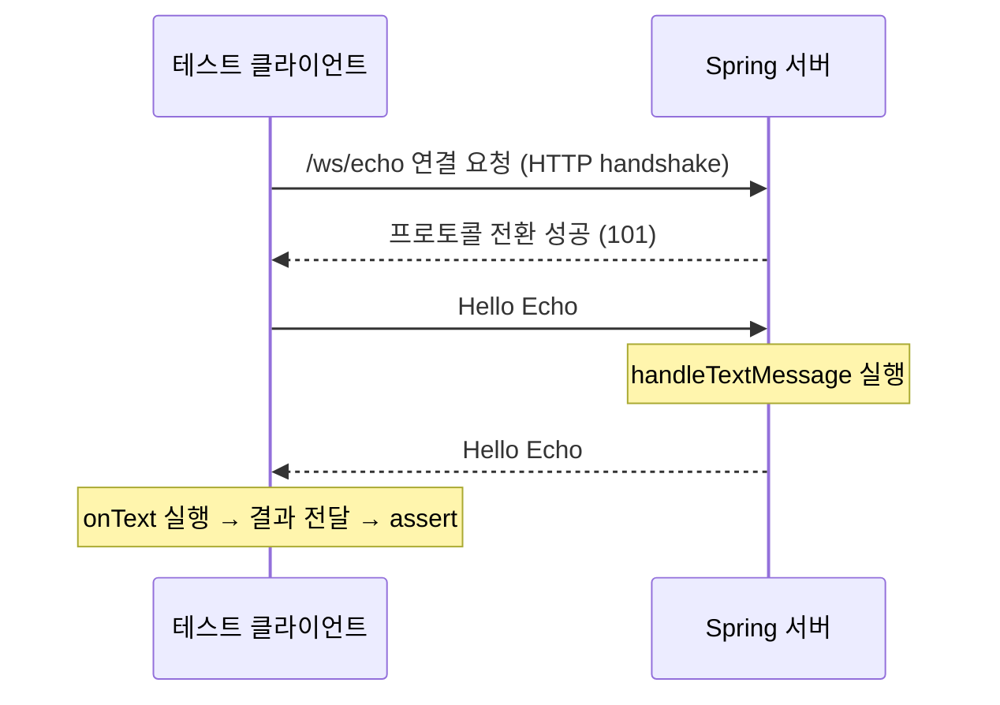

# WebSocket echo를 이해하고 테스트하기

작성일: 2026-10-10 · 대상: Java 21, Spring MVC 기반 현재 프로젝트

지금 목표는 `/ws/echo`에 `Hello Echo`를 보내고 같은 문자열을 돌려받는 것이다.
처음부터 모든 API를 외우기보다 **누가 보내고, 누가 받고, 언제 테스트가 결과를 확인하는지**를 따라가자.

## 1. 먼저 연결 그림 읽기 — 5분

[Spring: Introduction to WebSocket / HTTP Versus WebSocket](https://docs.spring.io/spring-framework/reference/web/websocket.html#websocket-intro)을 읽는다.
HTTP Upgrade 요청과 `101 Switching Protocols` 응답을 지나면 연결을 유지하며 양쪽이 메시지를 보낼 수 있다.
일반 HTTP처럼 메시지마다 새 요청·응답 경로를 찾는 방식과 구별하면 된다. [출처](https://docs.spring.io/spring-framework/reference/web/websocket.html)



현재 코드는 서버와 테스트 클라이언트를 모두 Java로 작성해서 이름이 비슷하지만, 역할은 다르다.

| 현재 파일 / 타입 | 역할 |
| --- | --- |
| `WebSocketConfiguration` | 접속 경로 `/ws/echo`와 서버 핸들러를 연결 |
| `EchoWebSocketHandler` | 서버가 문자열을 받았을 때 실행할 코드 |
| Spring의 `WebSocketSession` | 서버가 해당 클라이언트에게 응답하는 연결 객체 |
| `EchoWebSocketTest`의 Java `WebSocket` | 테스트가 서버에 연결하고 전송하는 클라이언트 객체 |
| Java `WebSocket.Listener` | 테스트 클라이언트에서 연결·수신·오류 시 실행할 코드 |

타입의 역할은 [Spring WebSocketSession](https://docs.spring.io/spring-framework/docs/current/javadoc-api/org/springframework/web/socket/WebSocketSession.html)과
[Java WebSocket / Listener](https://docs.oracle.com/en/java/javase/21/docs/api/java.net.http/java/net/http/WebSocket.html)에서 확인할 수 있다.

## 2. 서버 코드 읽기 — 5분

[Spring: WebSocket API의 WebSocketHandler 절](https://docs.spring.io/spring-framework/reference/web/websocket/server.html#websocket-server-handler)의 **Java 예제 두 개만** 먼저 읽는다.
`TextWebSocketHandler` 상속, `handleTextMessage`, `registry.addHandler`를 현재 파일과 나란히 비교하자.
서버 문자열 처리는 핸들러가, 주소 등록은 `WebSocketConfigurer`가 맡는다. [출처](https://docs.spring.io/spring-framework/reference/web/websocket/server.html)

현재 핸들러 흐름은 다음과 같다.

```text
message.getPayload() → 문자열
new TextMessage(payload) → 응답 메시지
session.sendMessage(response) → 보낸 클라이언트에게 전송
```

`@Component`는 컴포넌트 스캔으로 Spring 관리 객체에 등록되도록 하는 표시다.
현재 설정의 생성자 주입은 등록된 핸들러 객체를 받아 경로에 연결한다.
공식 예제의 `@Bean` 등록과 현재 `@Component` 등록은 등록 방법이 다르다. [Spring 컴포넌트 스캔](https://docs.spring.io/spring-framework/reference/core/beans/classpath-scanning.html)

확인 질문: **다른 사람에게도 메시지가 보이는가?**
현재 코드는 전달받은 `session` 하나로만 응답하므로 echo다. 여러 연결로 전달하는 채팅 구현은 다음 단계다.

## 3. 테스트 코드 읽기 — 10분

[Java 21: WebSocket.Listener](https://docs.oracle.com/en/java/javase/21/docs/api/java.net.http/java/net/http/WebSocket.Listener.html)의
`onOpen`, `onText`, `onError`를 먼저 읽는다. 콜백은 네가 순서대로 호출하는 메서드가 아니라,
연결이나 메시지 수신 같은 사건이 생겼을 때 라이브러리가 호출하는 메서드다. [출처](https://docs.oracle.com/en/java/javase/21/docs/api/java.net.http/java/net/http/WebSocket.Listener.html)

### 두 Future를 구별하기

| 변수 예시 | 무엇이 채워지는가? | 완료 시점 |
| --- | --- | --- |
| `CompletableFuture<WebSocket> connection` | 연결 객체 | `buildAsync`의 연결 작업 성공 |
| `CompletableFuture<String> received` | 받은 문자열 | 수신 콜백에서 직접 `complete` 호출 |

`buildAsync`의 반환은 **연결 성공 결과**다. 문자열 응답 결과를 반환하는 메서드는 아니다.
[Java Builder.buildAsync](https://docs.oracle.com/en/java/javase/21/docs/api/java.net.http/java/net/http/WebSocket.Builder.html#buildAsync(java.net.URI,java.net.http.WebSocket.Listener))

`received`는 테스트와 수신 콜백을 잇는 결과 상자라고 생각하자.
`new CompletableFuture<>()`는 미완료 결과를 만들고, `complete(value)`는 결과를 채운다.
[Java CompletableFuture](https://docs.oracle.com/en/java/javase/21/docs/api/java.base/java/util/concurrent/CompletableFuture.html)

```java
// 테스트 준비 부분: 수신 콜백이 접근할 수 있게 연결 전에 선언
CompletableFuture<String> received = new CompletableFuture<>();

// 완성된 문자열을 받은 콜백 안
received.complete(wholeMessage);

// 테스트 본문: 콜백에서 결과를 채울 때까지 최대 3초 기다림
String actual = received.get(3, TimeUnit.SECONDS);
```

`get(3, SECONDS)`는 완료되면 즉시 반환하고, 기한 내 완료되지 않으면 `TimeoutException`을 던진다.
`Thread.sleep(2000)`은 현재 스레드를 잠시 멈출 뿐 응답 도착을 확인하지 않는다.
[Future 대기](https://docs.oracle.com/en/java/javase/21/docs/api/java.base/java/util/concurrent/CompletableFuture.html#get(long,java.util.concurrent.TimeUnit)),
[Thread.sleep](https://docs.oracle.com/en/java/javase/21/docs/api/java.base/java/lang/Thread.html#sleep(long))

### request(1)과 last의 뜻

`webSocket.request(1)`은 수신 콜백을 한 번 더 호출해도 된다는 수신 처리량 요청이다.
서버로 HTTP 요청을 보내거나 다음 메시지를 가져오는 polling이 아니다.
호출 횟수 단위라서 완전한 메시지 한 개와도 항상 같지는 않다. [Java WebSocket.request](https://docs.oracle.com/en/java/javase/21/docs/api/java.net.http/java/net/http/WebSocket.html#request(long))

`onText`의 `data`는 문자열의 일부일 수 있다. `last == true`여야 그 메시지의 마지막 조각이다.
리스너에 `StringBuilder`를 두고 `append(data)`로 모은 뒤, 마지막 조각에서 `received.complete(text.toString())`한다.
각 조각 처리 후 다시 `request(1)`로 다음 수신 호출을 허용한다.
[Java Listener.onText](https://docs.oracle.com/en/java/javase/21/docs/api/java.net.http/java/net/http/WebSocket.Listener.html#onText(java.net.http.WebSocket,java.lang.CharSequence,boolean)),
[공식 누적 예제](https://docs.oracle.com/en/java/javase/21/docs/api/java.net.http/java/net/http/WebSocket.html#request(long))

현재 테스트의 `onError`에서 출력만 하면 기다리는 `received`는 오류를 모른다.
`received.completeExceptionally(error)`는 결과를 실패로 완료한다. 그러면 `get`은 원인을 담은 `ExecutionException`으로 실패한다.
[Java completeExceptionally](https://docs.oracle.com/en/java/javase/21/docs/api/java.base/java/util/concurrent/CompletableFuture.html#completeExceptionally(java.lang.Throwable))

`sendText`의 Future가 완료됐다는 것은 전송 작업 완료다. echo 수신은 별도 `received`로 확인해야 한다.
[Java sendText](https://docs.oracle.com/en/java/javase/21/docs/api/java.net.http/java/net/http/WebSocket.html#sendText(java.lang.CharSequence,boolean))

### 다음 작성 순서

1. 연결 전에 `received` 선언.
2. 리스너에서 조각 누적 → 마지막 조각이면 `received.complete`.
3. `onError`에서 `received.completeExceptionally`.
4. 연결과 전송 완료를 각각 제한 시간 안에 기다리고, `sleep`을 `received.get`으로 교체.
5. 받은 문자열을 독립적인 기대값 `"Hello Echo"`와 비교. 실패해도 연결이 정리되도록 마무리.

이 순서는 현재 echo 요구사항에 대한 작성 힌트이며, 이 문서를 만들면서 코드를 수정하거나 테스트를 실행하지는 않았다.
읽은 뒤 스스로 설명해볼 질문: **연결 Future가 이미 완료됐는데 문자열 Future는 아직 미완료일 수 있는 이유는 무엇일까?**
